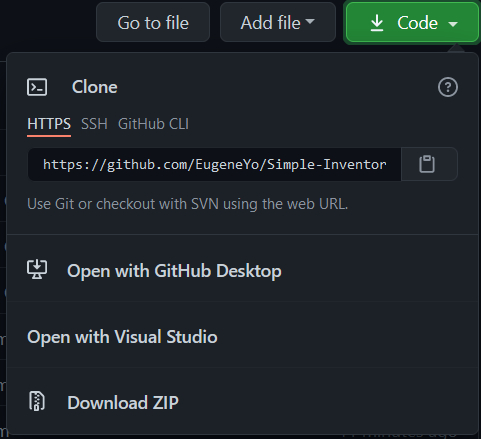

# Simple Inventory Management System with C

## Install Instructions

- Either using `git clone`

```
git clone https://github.com/EugeneYo/Simple-Inventory-Management-System-With-C.git
```

#### or

- Direct download the project as a zip file then extract it.



### For Windows

- After the project is downloaded or cloned, run the following command

```
.\build.bat
```

### For Linux

- After the project is downloaded or cloned, run the following command

```
./build.sh
```
